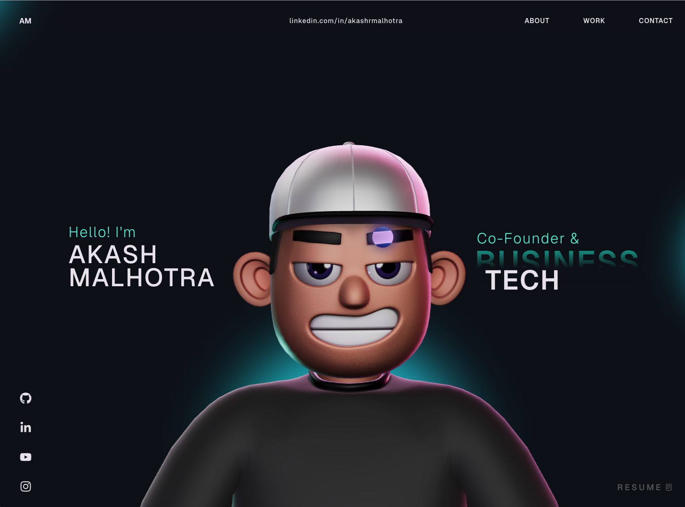

# Shayan Portfolio

Modern 3D personal portfolio built with React, TypeScript, Three.js, and GSAP.



## Live Demo

- Repository: https://github.com/shayanali1/shayan-portfolio
- GitHub Pages URL: https://shayanali1.github.io/shayan-portfolio/

## Features

- One-page portfolio experience with smooth section transitions.
- 3D character scene powered by React Three Fiber and Three.js.
- GSAP-based motion and scroll interactions.
- Custom cursor and hover effects.
- Responsive layout for desktop and mobile.

## Tech Stack

- React 18
- TypeScript
- Vite
- GSAP (`gsap`, `@gsap/react`)
- Three.js (`three`, `@react-three/fiber`, `@react-three/drei`)
- Physics and postprocessing (`@react-three/rapier`, `@react-three/cannon`, `@react-three/postprocessing`)

## Project Structure

```text
.
├── public/
├── src/
│   ├── components/
│   ├── context/
│   ├── data/
│   ├── App.tsx
│   └── main.tsx
├── index.html
├── package.json
└── vite.config.ts
```

## Getting Started

### Prerequisites

- Node.js 18+
- npm 9+

### Install and Run

```bash
npm install
npm run dev
```

Open the local URL shown in terminal (usually `http://localhost:5173`).

## Scripts

- `npm run dev`: start development server.
- `npm run build`: type-check and create production build.
- `npm run preview`: preview production build locally.
- `npm run lint`: run ESLint.

## Deployment Notes (GitHub Pages)

For this repository, set Vite base to your repo name:

```ts
// vite.config.ts
base: "/shayan-portfolio/"
```

Then build and deploy your `dist` folder using GitHub Pages.

## Customization

- Update personal content in `src/components/About.tsx`, `src/components/Career.tsx`, `src/components/WhatIDo.tsx`, and `src/components/Work.tsx`.
- Update contact/social links in `src/components/Contact.tsx` and `src/components/SocialIcons.tsx`.
- Edit visuals and styling in `src/components/styles/` and `src/index.css`.

## License

This project is licensed under the MIT License. See `LICENSE` for details.
